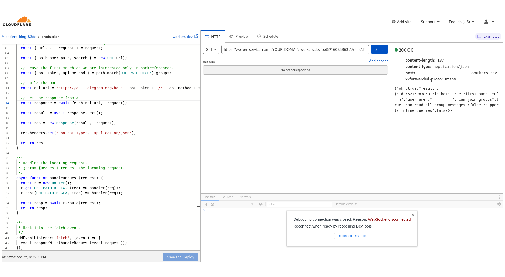

Send a message/file to the Telegram user requesting bot. First create a telegram bot via Bot father and then copy it's generated token here in python file.
To RUN:

1: Install Telegram bot python module 
1.1: If you have no ISP restriction on connecting Telegram api:
  Install python-telegram-bot:
	`pip3 install python-telegram-bot`

OR 

1.2:  If you are behind an ISP filter
   You should install module `python-telegram-bot` manually since telegram api url should be changed!  
   1.2.1: Create a CloudFlare worker & service ('https://dash.cloudflare.com')  
   1.2.2: Copy `index.js` contents inside CloudFlare worker's script box
   <table><tr width="1%"><td bgcolor="cyan" bordercolor= "blue" width="1500" height="1500">
    
   </td></tr></table>   
   1.2.3: Paste it's url (e.g. https://worker-service-name.YOUR-DOMAIN.workers.dev) into python file: 'python-telegram-bot/telegram/bot.py' into variables `base_url` and `base_file_url` instead of: `api.telegram.org`:  
	`python3 setup.py install`  
   Ref: (https://github.com/manzoorwanijk/telegram-bot-api-worker)

   Also you can set webhook of your bot by:  
        `curl https://api.telegram.org/bot[token]/setwebhook?url=https://worker-service-name.YOUR-DOMAIN.workers.dev/`
 
2: Run the send file:
	python3 sendbot.py
